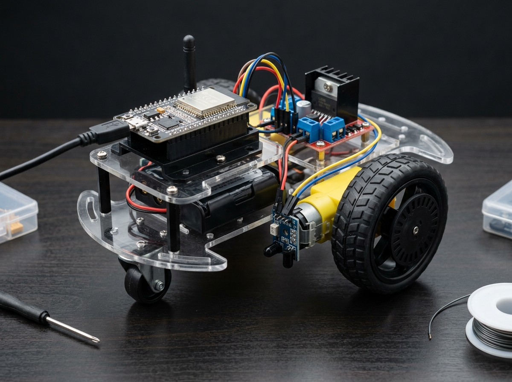

# NoobBot: ESP32 Encoder-Guided Robot Controller

An open-source ESP32 firmware for a two-wheeled differential drive robot controller featuring optical wheel encoder feedback, closed-loop distance and angular turning control, and Bluetooth Serial command telemetry with safety disconnect protection.



---

## Key Features

- **Closed-Loop Encoder Control**: Uses dual hardware interrupt (ISR) optical wheel encoders for distance measurement and turn angle resolution.
- **Independent Dual-Motor Stopping**: Encoder tracking loops ensure both wheels independently reach target encoder counts before terminating movement (`leftCount >= target` and `rightCount >= target`).
- **Bluetooth Disconnect Safety**: Automatic motor kill-switch when Bluetooth connection drops.
- **Configurable Control Constants**: Expressed cleanly with `constexpr` constants for pulse-to-distance conversion, default motor speed, and trajectory segments.
- **Handshake Telemetry**: Automatic `REQ` ready prompts transmitted over Bluetooth Serial for command synchronization.

---

## Hardware Pinout Summary

| ESP32 Pin | Connected Hardware | Description |
|---|---|---|
| GPIO 5 | L298N ENA | Left Motor Speed PWM (Channel 0) |
| GPIO 18 | L298N IN1 | Left Motor Direction Signal 1 |
| GPIO 19 | L298N IN2 | Left Motor Direction Signal 2 |
| GPIO 21 | L298N ENB | Right Motor Speed PWM (Channel 1) |
| GPIO 22 | L298N IN3 | Right Motor Direction Signal 1 |
| GPIO 23 | L298N IN4 | Right Motor Direction Signal 2 |
| GPIO 34 | Left Encoder Signal | Photoelectric Optical Encoder Interrupt Pin |
| GPIO 35 | Right Encoder Signal | Photoelectric Optical Encoder Interrupt Pin |

For complete wiring diagrams and power connections, see [docs/wiring.md](docs/wiring.md).

---

## Bluetooth Protocol Overview

The controller connects via Bluetooth Classic under the device name `noobbot`.

- **Move Command**: `CMD:MOVE:<distance_cm>`
- **Turn Command**: `CMD:TURN:<direction>:<degrees>` (e.g. `CMD:TURN:L:45`)

For the complete protocol specification and handshake behavior, see [docs/protocol.md](docs/protocol.md).

---

## Repository Structure

```
noobbot/
├── README.md
├── LICENSE
├── .gitignore
├── src/
│   └── noobbot.ino
├── docs/
│   ├── wiring.md
│   └── protocol.md
└── images/
    └── robot.jpg
```

---

## Getting Started

### Prerequisites
1. [Arduino IDE](https://www.arduino.cc/en/software) with **ESP32 Board Support Package** installed.
2. Select target board: **ESP32 Dev Module**.
3. Partition scheme: Default with Bluetooth Serial support.

### Building & Flashing
1. Clone this repository:
   ```bash
   git clone https://github.com/your-username/noobbot.git
   ```
2. Open `src/noobbot.ino` in Arduino IDE.
3. Select your ESP32 serial port and click **Upload**.
4. Pair your device to Bluetooth device `noobbot` and send commands via any Bluetooth Terminal app.

---

## License

This project is licensed under the [MIT License](LICENSE).
